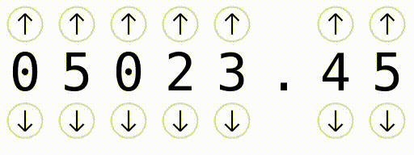

# elm-number-spinner

This Elm component allows displaying and editing *single digits* inside *decimal numbers* (positive and negative). Here's a little video on how it works:



What's there:

- Completely keyboard-driven (if it has the focus)
- Mouse clickable
- Can have upper and lower bounds

What's missing:

- Styling

## Example code

```elm
module Main exposing ()

import NumberSpinner.DecimalNumber as Decimal
import NumberSpinner.NumberSpinner as NumberSpinner


type alias Model =
    { spinner : NumberSpinner.Model Msg
    }


main : Program () Model Msg
main =
    Browser.element
        { init =
            \_ ->
                ( { spinner =
                        NumberSpinner.init
                            2
                            (Decimal.fromInt 0)
                            (Decimal.fromInt 10)
                            (Maybe.withDefault (Decimal.fromInt 0) <| Decimal.fromString "1.23")
                            (SpinnerMessage 0)
                  }
                , Cmd.none
                )
        , update = update
        , view = view
        , subscriptions = \_ -> Sub.none
        }


type Msg
    = SpinnerMessage NumberSpinner.Msg


update : Msg -> Model -> ( Model, Cmd Msg )
update msg model =
    case msg of
        SpinnerMessage subMsg ->
            let
                ( newModel, cmd ) =
                    NumberSpinner.update subMsg spinner
            in
            ( { model | spinner = newModel }, cmd )


view : Model -> Html Msg
view model =
    NumberSpinner.view model.spinner
```
